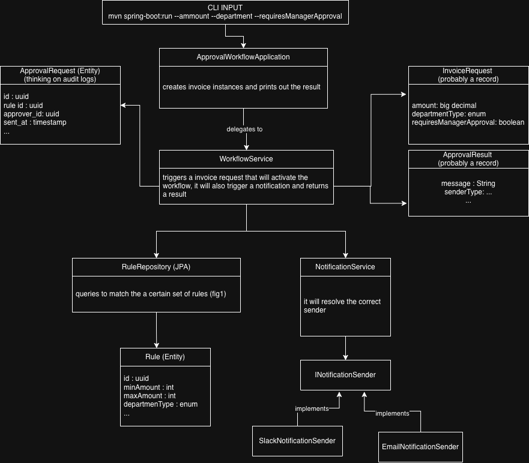

# Invoice Approval Workflow

A CLI application that simulates an invoice approval workflow. Based on configurable rules, it determines which approver should receive an approval request and via which notification channel (Slack or Email).

## Challenge Requirements

This project implements the [Light Backend Challenge](./challenge_readme.md):
- Database model supporting workflow configuration and execution
- Workflow simulation based on invoice amount, department, and manager approval requirements
- Two notification channels: Slack and Email (mocked with `println`)
- CLI interface for processing invoices

## Architecture


## Database Schema


## Pre-loaded Workflow (Fig.1)

The database is loaded with the following rules:

| Priority | Condition | Approver | Channel |
|----------|-----------|----------|---------|
| 1 | amount > 10,000 AND MARKETING | CMO | EMAIL |
| 2 | amount > 10,000 (any other dept) | CFO | SLACK |
| 3 | 5,000 < amount ≤ 10,000 AND manager approval required | Finance Manager | EMAIL |
| 4 | 5,000 < amount ≤ 10,000 AND no manager approval | Finance Team | SLACK |
| 5 | amount ≤ 5,000 | Finance Team | SLACK |

## Getting Started

### Prerequisites

- Java 21
- Maven
- Docker & Docker Compose

### 1. Start PostgreSQL

```bash
docker compose up -d
```

### 2. Build

```bash
mvn clean package -DskipTests
```

### 3. Run

```bash
# Using Maven
mvn spring-boot:run -Dspring-boot.run.arguments="--amount=15000 --department=MARKETING --managerApproval=false"

# Using JAR
java -jar target/approval-workflow-0.0.1-SNAPSHOT.jar --amount=15000 --department=MARKETING --managerApproval=false
```

> **Note:** On first run, Liquibase automatically creates the database schema and seeds the workflow rules from Fig.1.

### CLI Arguments

| Argument | Required | Description |
|----------|----------|-------------|
| `--amount=<value>` | Yes | Invoice amount in USD |
| `--department=<value>` | Yes | MARKETING, OTHER |
| `--managerApproval=<value>` | No | `true` or `false` (default: `false`) |

### Example Outputs

```bash
# High-value Marketing invoice → CMO via Email
--amount=15000 --department=MARKETING --managerApproval=false

# High-value non-Marketing invoice → CFO via Slack
--amount=15000 --department=OTHER --managerApproval=false

# Mid-value with manager approval → Finance Manager via Email
--amount=7500 --department=OTHER --managerApproval=true

# Low-value invoice → Finance Team via Slack
--amount=3000 --department=OTHER --managerApproval=false
```

## Audit Log

Every processed invoice is logged in the `approval_request` table with full context (amount, department, approver, channel, timestamp).

## Notes

- Only one workflow can be active at a time. This is enforced via a unique partial index on `workflow(active)`. 
